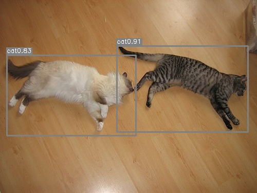

# yolo v1
## 项目目录
```text
｜--datasets             数据集划分及标签
    |--random.py            划分数据集 
    |--images.txt           VOC2007+VOC2012图片标签
    |--train.txt            训练集标签
    |--val.txt              验证集标签
    |--test_label.txt       测试集标签
｜--imgs                 测试图片
    |--xxx.jpg
｜--models               模型及损失函数
    |--resnet_yolo.py
    |--vgg_yolo.py
    |--yoloLoss.py         
｜--testimg              预测图片
｜--utils                工具
    |--dataset.py
    |--piplist2equal.py
    |--xml2txt.py           xml转txt
｜--train.py             训练
｜--predict.py           预测单张图片
｜--eval_voc.py          计算AP/mAP
｜--video.py             摄像头实时检测
｜--requirements.txt     环境
｜--log.txt              val_loss日志文件
｜--requirements.txt     环境  
```

## 1. 环境准备
详细内容参考[requirements.txt](requirements.txt)

## 2. 数据集准备
**下载数据集**   

**解压数据集**   
1、将voc2007和voc2012的所有图片放到目录下  

2、然后使用`utils/xml2txt.pyt`将xml文件转成txt格式。此步骤结果已经保存，可省略。

## 3.训练
```shell
python train.py
```
## 4.预测
```text
python predict.py
```
## 5.计算mAP
```text
python eval_voc.py
```

## 6.效果


## 附：权重文件
ylov1.pth

链接：https://pan.baidu.com/s/1wGUevPUSERBbSVYYpSao5g 
提取码：3se3